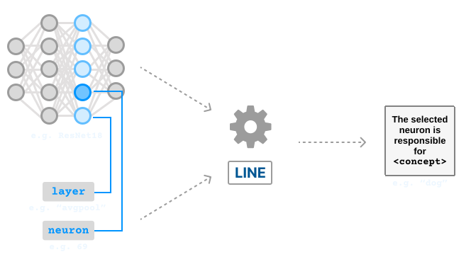
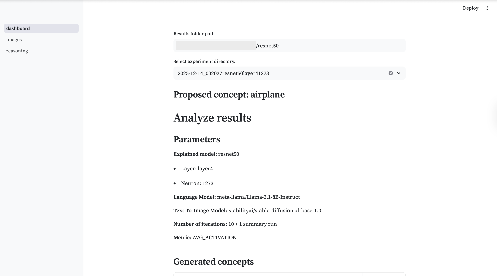
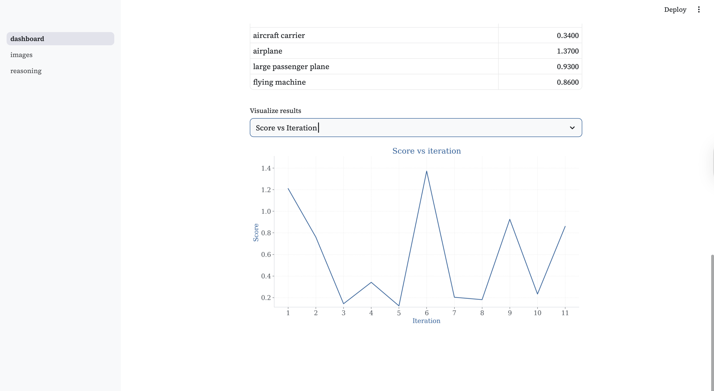
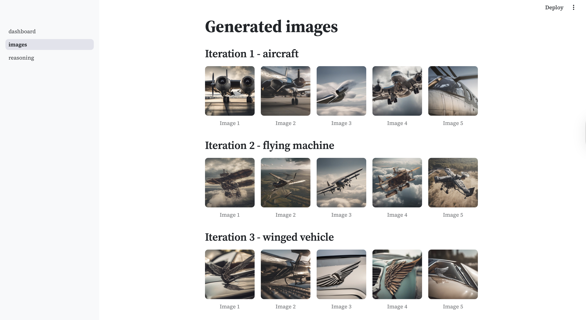
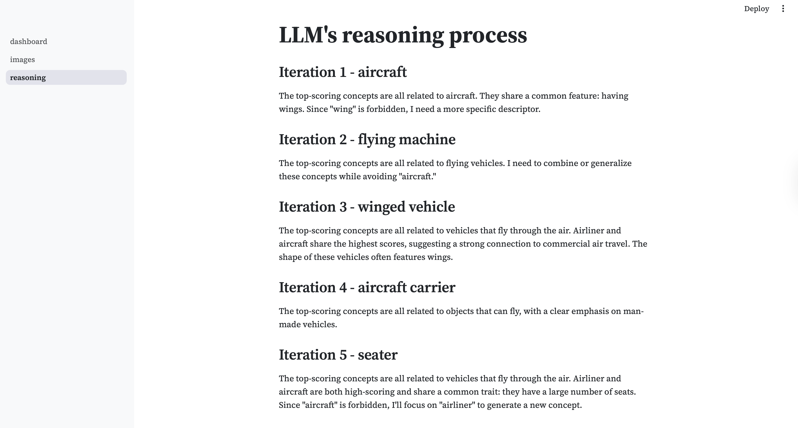

# LLM-based Iterative Neuron Explanation



### Developers
[Michał](https://github.com/piechotam) & [Gaspar](https://gasparsekula.com)

### Abstract

The increasing complexity of neural networks has created a critical need for methods that interpret their internal decision-making processes. One prominent approach is neuron labeling, which aims to explain model behavior by assigning human-understandable textual explanations (concepts) to individual neurons. We propose **LINE**, an iterative method for neuron labeling that automatically discovers the concept that most strongly activates a specific neuron without being restricted by a predefined, fixed vocabulary. Our method utilizes a optimization loop where a Language Model proposes candidate concepts, which are subsequently validated by generating synthetic images via Stable Diffusion and scoring their impact on the target neuron **response of the neuron**. The iterative process allows the system to discover new relevant concepts, absent in the predefined vocabulary. 

We evaluate our approach across several ResNet-family architectures, demonstrating its robustness in various deep learning contexts. Quantitative results show that LINE outperforms current state-of-the-art methodologies, CLIP-Dissect and INVERT, in providing more accurate and relevant explanations. Experiments show that 31% of the labels generated by our method exist outside of standard predefined vocabularies, proving that LINE can uncover features that traditional closed-vocabulary approaches overlook.

---
## 🗒️ Documentation


Documentation can be found [here](https://gasparsekula.github.io/LINE).

---

## 💻 System Requirements

#### Hardware

To achieve the best results with the recommended settings, the following hardware is required:

* **GPU:** At least **16 GB VRAM**
* **RAM:** At least **32 GB**
* **CPU:** 1x Core (minimum)

> [!NOTE]
> You can run smaller configurations (e.g., Llama-3.2-1B + SD-Turbo) with **12 GB RAM**, but the explanation quality will be significantly lower.

#### Software & Environment

* **Python:** Versions and dependencies are managed via `pyproject.toml`.
* **Package Manager:** We strongly recommend using [UV](https://docs.astral.sh/uv/) for fast, reliable dependency management.
* **Lockfile:** The exact environment used in our experiments is provided in `uv.lock`.

---

## 🚀 Installation & Setup

Follow these steps to get the environment ready:

1. Clone the Repository

```bash
git clone https://github.com/GasparSekula/NaCoSAE.git
cd NaCoSAE
```

2. Configure Environment Variables

Create a `.env` file in the root directory and add your credentials:

```env
HF_TOKEN=your_huggingface_token_here
SAVE_DIR=path/to/store/results
HF_HOME=path/to/huggingface/cache (optional)
```

3. Data Preparation

Download the ImageNet-1K dataset (required for the first run):

```bash
uv run scripts/download_imagenet.py
```

4. Calculate Control Activations

Pre-calculate activations for your target model and layer:

```bash
uv run src/calculate_control_activations.py
```

*Note: This can be skipped if activations for the specific model/layer already exist.*

---

## 🛠 Usage

#### Run the Pipeline

To start the explanation process with default settings:

```bash
uv run src/main.py
```

#### Recommended Settings (High Quality)

For optimal performance and insight quality, use the following configuration:

* **T2I Model:** Stable Diffusion XL Base 1.0
* **LLM:** Llama-3.1-8B-Instruct

**Run command:**

```bash
uv run src/main.py \
  --language_model meta-llama/Llama-3.1-8B-Instruct \
  --t2i_model stabilityai/stable-diffusion-xl-base-1.0 
```

#### Configuration Options

| Option | Description | Default Value |
| --- | --- | --- |
| `--t2i_model` | ID of the Diffusion model (SD-Turbo, SDXL-Turbo, SDXL-Base). | `stabilityai/sd-turbo` |
| `--explained_model` | CNN model to explain (ResNet-18, ResNet-50, ViT-B-16). | `resnet18` |
| `--language_model` | LLM for concept generation (Meta-Llama series). | `meta-llama/Llama-3.2-1B-Instruct` |
| `--layer` | The layer name to extract activations from. | `avgpool` |
| `--neuron_id` | ID of the specific neuron to explain. | `0` |
| `--num_inf_steps` | Number of inference steps for image generation. | `25` |
| `--num_img` | Images to generate per iteration. | `5` |
| `--metric` | Scoring metric for concepts (e.g., `AUC`). | `AUC` |
| `--n_iters` | Number of pipeline iterations. | `10` |
| `--save_images` | Whether to save generated images to disk. | `False` |

*For a full list of parameters, run `uv run src/main.py --help`.*

---

## 📊 Visualizing Results (Dashboard)

We provide a Streamlit-based dashboard to browse and analyze the generated explanations.

**1. Launch the Dashboard:**

```bash
uv run streamlit run app/dashboard.py
```

**2. Access the Interface:**
Open `http://localhost:8501` in your browser.

**3. Load Results:**

* Paste the path to your results parent directory into the sidebar.
* Select the specific experiment folder (e.g., `2025-12-08_resnet50...`) to visualize the neuron's learned concepts and generated imagery.

**Example dashboard results**

Main page (run parameters, generated concepts):



Main page (score over iterations):



Images page:



Reasoning page (Chain-of-Thought analysis):




---

## 🔗 Links

* **Repository:** [https://github.com/GasparSekula/NaCoSAE](https://github.com/GasparSekula/NaCoSAE)
* **Documentation:** [https://gasparsekula.github.io/LINE](https://gasparsekula.github.io/LINE)


